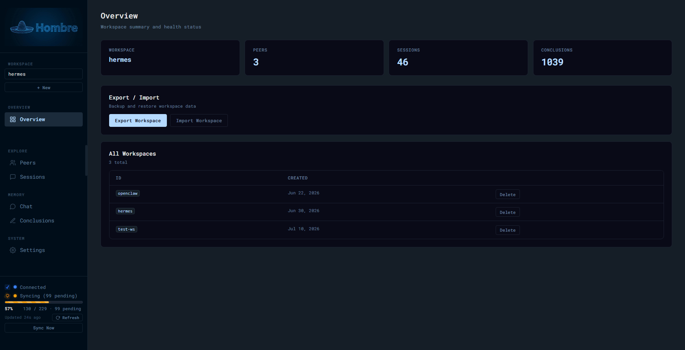

<div align="center">
  

[](LICENSE)
[](https://www.python.org/)
[](https://fastapi.tiangolo.com/)
[](https://www.docker.com/)
[](https://supabase.com)
[](https://opencode.ai)
[](https://huggingface.co/XiaomiMiMo/MiMo-V2.5)

</div>

<p align="center">
  
</p>

## Why This Exists

Honcho is open source. You can run the server yourself. But the dashboard, the thing you actually interact with, is only available on their hosted platform. Self-host the server and you get an API endpoint and nothing else.

Hombre gives you a full web UI for workspaces, peers, sessions, chat, and configuration. Everything runs locally on your machine.

Built entirely with AI coding tools ([OpenCode](https://opencode.ai) + [MiMo](https://huggingface.co/XiaomiMiMo/MiMo-V2.5)). No shame about it.

## Features

- **Sync Indicator** — sidebar shows real-time connection status (Connected/Offline), sync progress (pending/done/total) with a progress bar, colorblind-friendly icons, and "Updated Xs ago" timestamp
- **Manual Sync** — "Sync Now" button triggers Honcho's `schedule_dream` for the active workspace
- **Sync Stats** — shows work unit progress from Honcho's queue/status endpoint
- **Overview** — workspace stats, peer/session/conclusion counts at a glance
- **Peers** — list participants, view representations and peer cards, compare peers side-by-side
- **Sessions** — list conversations, view messages and summaries
- **Chat** — ask questions about a peer using natural language with streaming responses and typing indicator; adjustable reasoning depth
- **Conclusions** — browse and semantic search reasoning/memory with pagination and type filtering
- **Messages** — browse messages across all sessions with pagination
- **Settings** — configure LLM providers, embedding models, dialectic levels, Supabase, and more
- **LLM Model Simplification** — one model selector instead of configuring 5 dialectic levels individually (broadcasts to all levels on save)
- **Credential Management** — manage dashboard credentials (username, password, role) from the Settings page under "Dashboard Access"
- **Supabase Settings** — dedicated section in Settings for configuring Supabase (URL, keys) directly from the UI
- **Workspace Merge** — merge two workspaces with conflict detection and resolution

### Additional Features

- **Trash for Conclusions** — deleted conclusions go to trash, can be restored or permanently deleted
- **Soft Delete** — delete peers and messages locally (Honcho doesn't support native delete)
- **Export/Import** — export workspace data to portable JSON, import with conflict resolution
- **Notifications** — real-time notification bell for workspace events and new conclusions
- **Security** — role-based access control (admin/editor/viewer), rate limiting, audit logging
- **Typing Indicator** — animated dots while the model is thinking
- **Pagination** — load-more pattern for conclusions and messages
- **Colorblind-Friendly UI** — blue for synced, orange for syncing; icons alongside colors for non-color-dependent state
- **Browser Caching Fix** — all GET requests use `cache: 'no-store'` to prevent stale data
- **Fire-and-Forget Audit Logging** — Supabase audit writes no longer block user-facing responses
- **Supabase Integration** — optional Supabase support for auth, database storage, and real-time features
- **Event Loop Protection** — all synchronous I/O wrapped in `asyncio.to_thread()` to prevent event loop blocking

## Prerequisites

You need a running Honcho server. This dashboard is a frontend for it, it doesn't include the server itself.

- Honcho server running on `localhost:8000` (configurable via `HONCHO_URL`)
- See [honcho.dev](https://honcho.dev) for server setup instructions

## Quick Start

There are two ways to run Hombre: **from source** (good for development) and **Docker** (preferred for production). Both work perfectly fine — pick whichever fits your workflow.

### Option 1: Run from Source (Development)

Best for: active development, testing changes quickly, or running alongside Honcho on the same machine without Docker overhead.

Requires Python 3.12+.

```bash
git clone https://github.com/lovethatbrandx/hombre.git
cd hombre
python -m venv .venv
source .venv/bin/activate
pip install -r requirements.txt
```

Set the required environment variables:

```bash
export HONCHO_ENV_PATH=/path/to/honcho/.env
export HONCHO_COMPOSE_DIR=/path/to/honcho
```

Then run with live reload (auto-restarts on code changes):

```bash
python3 -m uvicorn app:app --host 0.0.0.0 --port 5000 --reload
```

Or without auto-reload:

```bash
python app.py
```

Dashboard runs at `http://localhost:5000`.

### Option 2: Docker (Production Preferred)

Best for: production deployments, consistent environments, zero dependency conflicts, and easy updates.

Your deployment folder contains only deployment files (`docker-compose.yml`, `.env`, `.env.example`, `.gitignore`, and `LICENSE`). No source code lives there.

The Docker image is built from the development repo and pushed to `ghcr.io/lovethatbrandx/hombre/hombre:latest`.

**Why Docker is preferred for production:**
- **Container isolation** — won't conflict with other Python versions or system packages
- **Easy deployment** — just `docker compose up -d`, done
- **Health checks** — automatic liveness checks with auto-restart on failure
- **Volume mounts** — Honcho config and backups persist across container rebuilds
- **Consistent updates** — `docker compose pull && docker compose up -d` to update

Edit the environment variables in your `.env` file to match your setup:

```yaml
services:
  hombre:
    image: ghcr.io/lovethatbrandx/hombre/hombre:latest
    container_name: hombre
    ports:
      - "5000:5000"
    environment:
      - HONCHO_URL=http://host.docker.internal:8000
      - HONCHO_ENV_PATH=/path/to/honcho/.env    # <-- change this
      - HONCHO_COMPOSE_DIR=/path/to/honcho      # <-- and this
    extra_hosts:
      - "host.docker.internal:host-gateway"
    healthcheck:
      test: ["CMD", "python", "-c", "import urllib.request; urllib.request.urlopen('http://localhost:5000/api/health')"]
      interval: 10s
      timeout: 5s
      retries: 3
    restart: unless-stopped
```

Then run:

```bash
cd your/deploy/folder/
docker compose up -d
```

To update:

```bash
cd your/deploy/folder/
docker compose pull
docker compose up -d
```

### Which Should I Pick?

| Scenario | Recommendation |
|----------|----------------|
| Developing Hombre itself | **Run from source** — use `--reload` for instant feedback |
| Running Hombre + Honcho on one machine | **Run from source** — less overhead, both share the same host |
| Production / daily driver | **Docker** — set it and forget it, auto-restarts if it crashes |
| Quick test without installing Python deps | **Docker** — no venv, no pip, just `docker compose up -d` |
| CI/CD or automated deployments | **Docker** — reproducible, no manual setup steps |

## Architecture

```
┌─────────────┐     HTTP/REST      ┌──────────────┐
│   Browser   │ ────────────────── │  Hombre API  │
│  (Vanilla   │    /api/* proxy    │  (FastAPI)   │
│   JS SPA)   │ ◄──────────────── │  Port 5000   │
└─────────────┘                    └──────┬───────┘
                                          │
                                   HTTP   │  /v3/* proxy
                                          │
                                   ┌──────▼───────┐
                                   │ Honcho Server│
                                   │  Port 8000   │
                                   └──────────────┘

Optional:
  Hombre ──► Supabase (auth, storage, audit logs)
```

- **Frontend**: Single-page app in vanilla HTML/CSS/JS (no build tools, no frameworks). Tabs load content dynamically into `#main-content`.
- **Backend**: Python FastAPI app that proxies requests to Honcho's `/v3/` API and adds features Honcho doesn't provide (soft delete, export/import, sync status, audit logging).
- **Data flow**: Browser → Hombre `/api/*` → Honcho `/v3/*`. Hombre adds authentication, rate limiting, RBAC, and supplementary endpoints.

## Configuration

| Variable | Required | Default | Description |
|----------|----------|---------|-------------|
| `HONCHO_URL` | No | `http://localhost:8000` | Honcho server URL |
| `HONCHO_API_KEY` | No | *(empty)* | API key for Honcho server authentication |
| `HONCHO_ENV_PATH` | No | *(empty)* | Path to Honcho `.env` file (for settings tab) |
| `HONCHO_COMPOSE_DIR` | No | *(empty)* | Docker Compose working directory for Honcho server |
| `DASHBOARD_USER` | No | *(empty)* | HTTP Basic Auth username (empty = no auth) |
| `DASHBOARD_PASSWORD` | No | *(empty)* | HTTP Basic Auth password (empty = no auth) |
| `DASHBOARD_ROLE` | No | `admin` | Role for single-user mode: `admin`, `editor`, or `viewer` |
| `DASHBOARD_USERS` | No | *(empty)* | Multi-user config: `user1:pass1:admin,user2:pass2:viewer` |
| `HOMBRE_LOG_DIR` | No | `logs` | Directory for access and audit logs |
| `SUPABASE_URL` | No | *(empty)* | Supabase project URL (enables Supabase integration) |
| `SUPABASE_KEY` | No | *(empty)* | Supabase anon/public key |
| `SUPABASE_SERVICE_KEY` | No | *(empty)* | Supabase service role key (for admin operations) |

> **Note:** `HONCHO_ENV_PATH` and `HONCHO_COMPOSE_DIR` are optional. The app starts without them, but the Settings tab won't work until they're set.

## Settings Tab

The settings tab reads and writes the Honcho `.env` configuration file. Changes require a restart to take effect. When running in Docker, "Apply & Restart" handles this automatically.

### Configurable Sections

- **LLM Provider** — API key
- **Embeddings** — model, base URL, transport, vector dimensions
- **Deriver** — background worker model config
- **LLM Model (Dialectic)** — single model selector that broadcasts to all 5 dialectic levels (minimal/low/medium/high/max)
- **Summary** — summary generation model config
- **Dream** — deduction and induction model configs
- **Advanced** — vector store, cache, database connection settings
- **Supabase** — Supabase URL, anon key, and service key (Hombre's own config)
- **Dashboard Access** — manage dashboard credentials (username, password, role) directly from the UI without editing env vars

### How It Works

1. Settings are read from the `.env` file at `HONCHO_ENV_PATH`
2. Edits are tracked client-side (dirty state with orange dot indicators)
3. "Save Changes" writes to `.env` (creates `.env.bak` backup)
4. "Apply & Restart" writes to `.env` and runs `docker compose up -d --force-recreate` (Docker mode only; manual restart needed for source installs)
5. "Restore Backup" reverts to the previous `.env.bak`

## API Endpoints

### Hombre-Specific Endpoints (not proxied to Honcho)

| Method | Path | Description |
|--------|------|-------------|
| `GET` | `/api/health` | Health check (no Honcho dependency) |
| `GET` | `/api/auth/status` | Check if Supabase auth is configured |
| `POST` | `/api/auth/login` | Login with email/password |
| `POST` | `/api/auth/magic-link` | Send magic link |
| `POST` | `/api/auth/logout` | Logout current user |
| `POST` | `/api/sync/trigger` | Manual sync — triggers Honcho's `schedule_dream` |
| `GET` | `/api/sync/status/{wid}` | Queue status for a workspace |
| `GET` | `/api/settings/read` | Read Honcho `.env` settings |
| `POST` | `/api/settings/write` | Write settings to `.env` |
| `GET` | `/api/settings/supabase` | Read Supabase config |
| `POST` | `/api/settings/supabase` | Write Supabase config |
| `GET` | `/api/settings/users` | List dashboard users |
| `POST` | `/api/settings/users` | Update dashboard users |
| `POST` | `/api/settings/backup` | Create `.env` backup |
| `GET` | `/api/settings/backups` | List backups |
| `POST` | `/api/settings/restore` | Restore from backup |
| `POST` | `/api/settings/restart` | Restart Honcho containers |
| `POST` | `/api/soft-delete` | Soft-delete a resource |
| `POST` | `/api/soft-delete/check` | Check if resources are soft-deleted |
| `GET` | `/api/soft-delete/list` | List soft-deleted resources |
| `POST` | `/api/soft-delete/restore` | Restore a soft-deleted resource |
| `POST` | `/api/export/workspace/{wid}` | Export entire workspace |
| `POST` | `/api/export/peer/{wid}/{pid}` | Export single peer |
| `POST` | `/api/export/conclusions/{wid}` | Export all conclusions |
| `POST` | `/api/export/import/workspace` | Upload JSON for import preview |
| `POST` | `/api/export/import/confirm` | Confirm import with conflict resolution |
| `POST` | `/api/workspaces/merge/preview` | Preview merge conflicts |
| `POST` | `/api/workspaces/merge` | Execute workspace merge |
| `DELETE` | `/api/workspaces/{wid}/conclusions/{cid}` | Move conclusion to trash |
| `DELETE` | `/api/workspaces/{wid}/sessions/{sid}/messages/{mid}` | Delete message from Honcho |
| `GET` | `/api/trash/conclusions` | List trashed conclusions |
| `POST` | `/api/trash/conclusions/{cid}/restore` | Restore trashed conclusion |
| `DELETE` | `/api/trash/conclusions/{cid}` | Permanently delete from trash |
| `POST` | `/api/workspaces/{wid}/conclusions/list/all` | Fetch ALL conclusions (paginated) |
| `POST` | `/api/workspaces/{wid}/sessions/{sid}/messages/list/all` | Fetch ALL messages (paginated) |
| `GET` | `/api/notifications` | Get active notifications |
| `POST` | `/api/notifications/dismiss` | Dismiss a notification |

### Proxied Endpoints

All other `GET`/`POST`/`PUT`/`DELETE` requests to `/api/{path}` are proxied to Honcho's `/v3/{path}`.

## Security

- **Basic Auth** — Set `DASHBOARD_USER` and `DASHBOARD_PASSWORD` to enable HTTP Basic Auth. Without these, the dashboard is unauthenticated. Credentials can also be managed from the Settings page under "Dashboard Access".
- **Supabase Auth** — Set `SUPABASE_URL`, `SUPABASE_KEY`, and `SUPABASE_SERVICE_KEY` to enable Supabase authentication with email/password and magic links. Falls back to Basic Auth when not configured.
- **Role-Based Access** — Three roles: `admin` (full access), `editor` (create/edit/read), `viewer` (read-only). Configure via `DASHBOARD_ROLE` or `DASHBOARD_USERS`.
- **Rate Limiting** — In-memory sliding window rate limiter. Returns 429 with Retry-After header. `/api/settings/` and `/api/workspaces/` endpoints support up to 30 requests/minute.
- **Audit Logging** — All settings changes logged to `logs/audit.log` with username and changed keys. Supabase writes are fire-and-forget (non-blocking).
- **Request Logging** — All API requests logged to `logs/access.log` with timing and user info.
- **Bind address** — Binds to `0.0.0.0:5000` (all interfaces). Use a firewall or reverse proxy for production.
- **API key exposure** — The LLM API key is visible in the settings tab. Make sure the dashboard isn't publicly accessible.
- **Path traversal** — Proxy validates and URL-decodes paths before forwarding.
- **Security headers** — CSP, HSTS, X-Content-Type-Options, X-Frame-Options, X-XSS-Protection.

## Project Structure

```
hombre/
├── app.py                      # FastAPI backend (auth, proxy, routes, pagination)
├── routes/
│   ├── __init__.py
│   ├── security.py             # Security middleware (RBAC, rate limiting, logging)
│   ├── settings.py             # Settings API (read/write .env, restart, sync trigger/status)
│   ├── deletes.py              # Soft-delete registry (Supabase or JSON file storage)
│   ├── notifications.py        # Notification system (Supabase or JSON file storage)
│   ├── export.py               # Export/Import API, workspace merge, trash endpoints
│   └── supabase.py             # Supabase client initialization (optional integration)
├── static/
│   ├── index.html              # SPA shell with sidebar nav and sync indicator
│   ├── style.css               # Dark theme CSS (colorblind-friendly sync states)
│   ├── app.js                  # Frontend logic (tabs, sync indicator, modal, notifications)
│   ├── icon.svg                # App icon
│   ├── hombre_logo.jpg         # Sidebar logo
│   └── app_screenshot.png      # Screenshot for README
├── docs/
│   ├── API.md                  # Complete API reference
│   ├── FEATURES.md             # Feature documentation
│   └── DEPLOYMENT.md           # Deployment guide
├── data/                       # Auto-created at runtime
│   ├── deleted.json            # Soft-deleted resource IDs
│   ├── notifications.json      # Recent notifications
│   └── trash/                  # Trashed conclusions
│       └── conclusions.json
├── logs/                       # Auto-created at runtime
│   ├── access.log              # Request logs
│   └── audit.log               # Settings change logs
├── requirements.txt
├── Dockerfile
└── docker-compose.yml
```

## License

MIT
